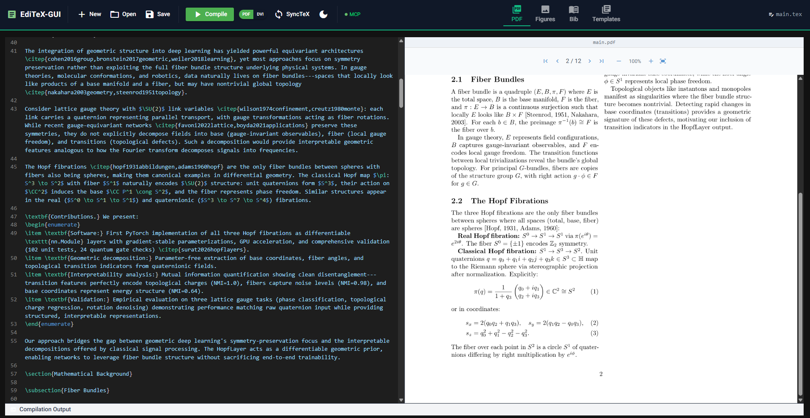

# EdiTeX-GUI

A web-based LaTeX editor with real-time PDF preview and AI-assisted editing via Claude Code MCP integration.

Built with [NiceGUI](https://nicegui.io/), [PyMuPDF](https://pymupdf.readthedocs.io/), and [FastMCP](https://github.com/jlowin/fastmcp).



## Features

- **CodeMirror LaTeX editor** with syntax highlighting, dark/light themes (VS Code Dark, GitHub Light)
- **Real-time PDF preview** rendered with PyMuPDF at retina-quality DPI
- **Zoom controls** -- zoom in/out, fit-to-width -- plus page navigation
- **SyncTeX forward search** -- jump from source line to PDF location
- **Figure gallery** with drag-and-drop image upload and one-click insertion
- **Bibliography manager** for `.bib` file editing with bibtexparser
- **Template library** -- Basic Article, IEEE Conference, ACM, arXiv preprint
- **Auto-save** every 30 seconds
- **Compilation error/warning panel** with clickable jump-to-line
- **MCP Server** with 10 tools for AI-assisted editing through Claude Code
- **Dark/light theme toggle** for editor and full UI
- **PDF and DVI output** format support
- **File browser** with recent files history and Windows drive navigation
- **Keyboard shortcuts** -- `Ctrl+S` save, `Ctrl+B` compile
- **Desktop launcher** for one-click startup on Windows

## Quick Start

```bash
# Prerequisites: Python 3.13+, uv, MiKTeX (or TeX Live)

git clone https://github.com/ugureren/editex-gui.git
cd editex-gui
uv sync
uv run python -m src.app
```

The editor opens at [http://localhost:8080](http://localhost:8080).

> For detailed installation steps, see [docs/installation.md](docs/installation.md).

## Architecture

EdiTeX-GUI runs as two cooperating processes:

```
Browser  <--- WebSocket --->  NiceGUI App (localhost:8080)  <--- HTTP --->  MCP Server  <--- stdio --->  Claude Code
```

The **NiceGUI App** serves the web UI and exposes a FastAPI REST API at `/api/*`. The **MCP Server** bridges Claude Code tool calls to the REST API via HTTP, allowing Claude to read, edit, compile, and inspect LaTeX documents.

> For a deep dive into the architecture, see [docs/architecture.md](docs/architecture.md).

## MCP Integration (AI-Assisted Editing)

Add to `~/.mcp.json`:

```json
{
  "mcpServers": {
    "editex": {
      "command": "uv",
      "args": [
        "run",
        "--directory", "C:/path/to/editex-gui",
        "python", "-m", "src.mcp"
      ]
    }
  }
}
```

Then ask Claude Code to work on your document:

```
> Read my LaTeX document and fix any compilation errors
> Add a new subsection called "Related Work" after the Introduction
> Show me the document structure
```

| Tool | Description |
|---|---|
| `get_document_content` | Read the current LaTeX source |
| `update_document_content` | Replace the document content |
| `compile_document` | Save and compile (returns errors/warnings) |
| `get_compilation_errors` | Retrieve latest compilation results |
| `get_document_structure` | Parse sections, labels, refs, citations, packages |
| `search_replace` | Find and replace (literal or regex) |
| `insert_at_position` | Insert text at a line number |
| `get_project_info` | File path, project dir, compilation status |
| `list_project_files` | List all project files |
| `read_file` | Read any project file (`.bib`, `.sty`, etc.) |

> For full MCP setup and tool reference, see [docs/mcp-integration.md](docs/mcp-integration.md).

## Configuration

Key constants in `src/utils/config.py`:

| Constant | Default | Description |
|---|---|---|
| `MIKTEX_BIN_DIR` | MiKTeX default install path | Path to MiKTeX binaries |
| `APP_PORT` | `8080` | Web server port |
| `PDF_RENDER_DPI_SCALE` | `2.0` | PDF render quality (2x = retina) |
| `DEFAULT_PROJECT_DIR` | `~/latex-projects` | Where new projects are created |

For TeX Live, update `MIKTEX_BIN_DIR` to your TeX Live `bin/` directory.

## Project Structure

```
editex-gui/
├── pyproject.toml              # Project metadata and dependencies
├── src/
│   ├── app.py                  # NiceGUI application entry point
│   ├── api.py                  # FastAPI REST endpoints (/api/*)
│   ├── state.py                # Global EditorState singleton
│   ├── editor/
│   │   ├── compiler.py         # pdflatex compilation + log parsing
│   │   ├── component.py        # CodeMirror editor wrapper
│   │   ├── file_manager.py     # File open/save/new project
│   │   ├── pdf_viewer.py       # PyMuPDF PDF rendering + zoom
│   │   └── synctex.py          # SyncTeX forward/inverse search
│   ├── mcp/
│   │   ├── server.py           # FastMCP tool definitions (10 tools)
│   │   └── bridge.py           # HTTP bridge to NiceGUI API
│   ├── panels/
│   │   ├── errors.py           # Compilation error/warning display
│   │   ├── figures.py          # Figure gallery + drag-drop upload
│   │   ├── bibliography.py     # Bibliography (.bib) manager
│   │   └── templates.py        # Template library
│   └── utils/
│       ├── config.py           # Paths and configuration constants
│       └── latex_parser.py     # LaTeX document structure parser
├── templates/                  # LaTeX document templates
│   ├── basic.tex               # Simple article
│   ├── ieee.tex                # IEEE conference format
│   ├── acm.tex                 # ACM computing paper
│   └── arxiv.tex               # arXiv preprint
├── docs/                       # Documentation
│   ├── architecture.md         # Architecture deep dive
│   ├── installation.md         # Windows installation guide
│   ├── mcp-integration.md      # MCP setup and tool reference
│   └── user-guide.md           # How to use the editor
└── tests/                      # Test suite (72 tests)
    ├── conftest.py             # Shared fixtures
    ├── test_latex_parser.py    # LaTeX parser tests
    ├── test_compiler.py        # Compiler log parsing tests
    └── test_api.py             # API logic tests
```

## Development

```bash
# Install with dev dependencies
uv sync --extra dev

# Run tests
uv run pytest tests/ -v

# Run the app
uv run python -m src.app
```

## Technology Stack

| Component | Technology |
|---|---|
| Web UI | [NiceGUI](https://nicegui.io/) (Python, Quasar components) |
| Code editor | [CodeMirror](https://codemirror.net/) (via NiceGUI) |
| PDF rendering | [PyMuPDF](https://pymupdf.readthedocs.io/) |
| MCP server | [FastMCP](https://github.com/jlowin/fastmcp) |
| REST API | [FastAPI](https://fastapi.tiangolo.com/) (built into NiceGUI) |
| HTTP client | [httpx](https://www.python-httpx.org/) |
| Bibliography | [bibtexparser](https://bibtexparser.readthedocs.io/) |
| Package manager | [uv](https://docs.astral.sh/uv/) |

## License

MIT License. See [LICENSE](LICENSE) for details.

## Contributing

1. Fork the repository
2. Create a feature branch (`git checkout -b feature/your-feature`)
3. Make changes and add tests
4. Run the test suite (`uv run pytest tests/ -v`)
5. Commit and open a pull request
